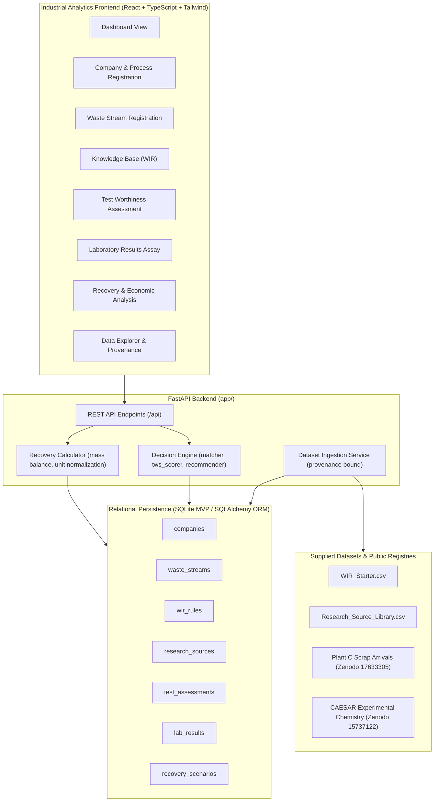
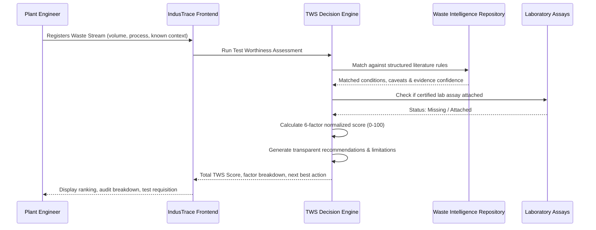

# Architecture and Workflow Diagrams — IndusTrace AI

```mermaid
flowchart TD
    subgraph UI["Industrial Analytics Frontend (React + TypeScript + Tailwind)"]
        Dashboard["Dashboard View"]
        CompanyReg["Company & Process Registration"]
        WasteReg["Waste Stream Registration"]
        WIRView["Knowledge Base (WIR)"]
        TWSView["Test Worthiness Assessment"]
        LabView["Laboratory Results Assay"]
        RecView["Recovery & Economic Analysis"]
        DataExp["Data Explorer & Provenance"]
    end

    subgraph API["FastAPI Backend (app/)"]
        Router["REST API Endpoints (/api)"]
        DecisionEngine["Decision Engine (matcher, tws_scorer, recommender)"]
        RecoveryEngine["Recovery Calculator (mass balance, unit normalization)"]
        DataLoader["Dataset Ingestion Service (provenance bound)"]
    end

    subgraph DB["Relational Persistence (SQLite MVP / SQLAlchemy ORM)"]
        T_Comp["companies"]
        T_Waste["waste_streams"]
        T_WIR["wir_rules"]
        T_Src["research_sources"]
        T_Ass["test_assessments"]
        T_Lab["lab_results"]
        T_Rec["recovery_scenarios"]
    end

    subgraph Datasets["Supplied Datasets & Public Registries"]
        WIRStarter["WIR_Starter.csv"]
        SrcLib["Research_Source_Library.csv"]
        PlantC["Plant C Scrap Arrivals (Zenodo 17633305)"]
        CAESAR["CAESAR Experimental Chemistry (Zenodo 15737122)"]
    end

    UI --> Router
    Router --> DecisionEngine
    Router --> RecoveryEngine
    DataLoader --> Datasets
    DataLoader --> DB
    DecisionEngine --> DB
    RecoveryEngine --> DB
```

### TWS Decision Evaluation Flow

```mermaid
sequenceDiagram
    participant User as Plant Engineer
    participant UI as IndusTrace Frontend
    participant Engine as TWS Decision Engine
    participant WIR as Waste Intelligence Repository
    participant Lab as Laboratory Assays

    User->>UI: Registers Waste Stream (volume, process, known context)
    UI->>Engine: Run Test Worthiness Assessment
    Engine->>WIR: Match against structured literature rules
    WIR-->>Engine: Matched conditions, caveats & evidence confidence
    Engine->>Lab: Check if certified lab assay attached
    Lab-->>Engine: Status: Missing / Attached
    Engine->>Engine: Calculate 6-factor normalized score (0-100)
    Engine->>Engine: Generate transparent recommendations & limitations
    Engine-->>UI: Total TWS Score, factor breakdown, next best action
    UI-->>User: Display ranking, audit breakdown, test requisition
```
